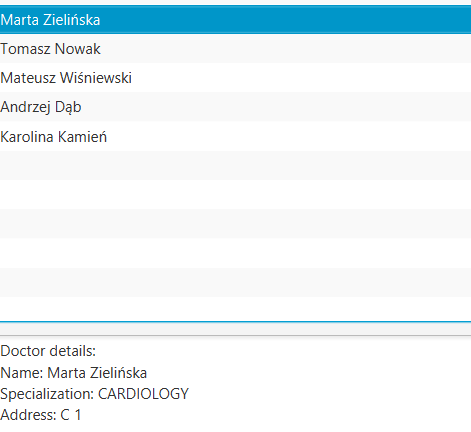

# Clinic App


## Backend Access
Run `ClinicApplication.java` to access the SpringBoot app at http://localhost:8080.

- Add doctor (Anna Nowak, PESEL: 00000000000, specialization: CARDIOLOGY, address: A 1) with:
```http
POST http://localhost:8080/doctors
Content-Type: application/json

{
  "firstName": "Anna",
  "lastName": "Nowak",
  "pesel": "00000000000",
  "specialization": "CARDIOLOGY",
  "address": "A 1"
}
 ```
- To see doctors list go to http://localhost:8080/doctors.
- See doctor with ID 1 details at http://localhost:8080/1 etc.
- Delete doctor with ID 1 with
```http
 DELETE http://localhost:8080/1
 ```


## Frontend Access
Run the backend first by running `ClinicApplication.java`. Then run `ClinicApplicationFX.java`.

If it doesn’t work, you can also run the app using Gradle from IntelliJ:
- Open the Gradle panel
- Go to `clinic -> Tasks -> application`
- Run `run`


### Application Preview & Features
After launching the application, the window should look like this:


- Button **ADD DOCTOR** - ...

- Button **ADD DOCTORS** – adds **7 sample doctors** to the database:
  **3** with one specialization, **2** with another, **1** with a third, and **1** with a fourth.
  After clicking this button, the doctors list and database should be filled with example records.


- When you click a doctor in the list, the application displays that doctor’s details in the bottom section of the window.



- Button **DELETE SELECTED DOCTOR** – removes the currently selected doctor from the list/database.

- Button **DELETE ALL DOCTORS** – removes all doctors from the list/database.
