# Clinic App

## Diagram UML
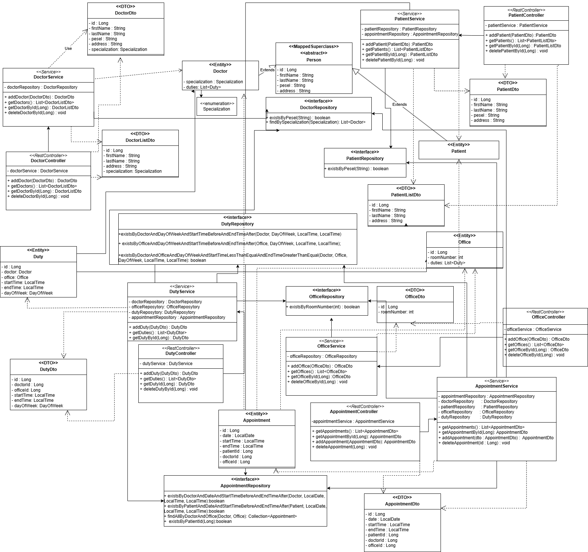


## Backend Access
Run `ClinicApplication.java` to access the SpringBoot app at http://localhost:8080.

### Doctors
- Add doctor (Anna Nowak, PESEL: 00000000000, specialization: CARDIOLOGY, address: A 1) with:
```http
POST /doctors
Content-Type: application/json

{
  "firstName": "Anna",
  "lastName": "Nowak",
  "pesel": "00000000000",
  "specialization": "CARDIOLOGY",
  "address": "A 1"
}
 ```
>PESEL must be unique.

- To see the list of doctors
```http
GET /doctors
 ```
- See doctor details
```http
GET /doctors/{id}
 ```
- Delete doctor with
```http
DELETE /doctors/{id}
 ```
>Deleting doctor is blocked if duties are assigned to them.

### Patients
- Add patient (Piotr Lis, PESEL: 77777777777, address: Bee 1) with:
```http
POST /patients
Content-Type: application/json

{
  "firstName": "Piotr",
  "lastName": "Lis",
  "pesel": "77777777777",
  "address": "Bee 1"
}
 ```
>PESEL must be unique.
- To see the list of patients
```http
GET /patients
 ```
- See patient details
```http
GET /patients/{id}
 ```
- Delete patient with
```http
DELETE /patients/{id}
 ```
>Deleting a patient is blocked if the patient has appointments.

### Offices
- Add office (room number: 101) with:
```http
POST /offices
Content-Type: application/json

{
  "roomNumber": 101
}
 ```
- To see the list of offices
```http
GET /offices
 ```
- See office details
```http
GET /offices/{id}
 ```
- Delete office with
```http
DELETE /offices/{id}
 ```
>Deleting office is blocked if duties are assigned to it.

### Duties
- Assign duty (doctor id: 1, office id: 1, day of week: Monday, start time: 08:00, end time: 10:00) with:
```http
POST /duties
Content-Type: application/json

{
  "doctorId": 1,
  "officeId": 1,
  "dayOfWeek": "MONDAY",
  "startTime": "08:00",
  "endTime": "10:00"
}

 ```
>Doctor cannot have overlapping duties, Office cannot have overlapping duties, startTime must be before endTime.

- To see the list of duties
```http
GET /duties
 ```
- See duty details
```http
GET /duties/{id}
 ```
- Delete duty with
```http
DELETE /duties/{id}
 ```
>Deleting a duty is blocked if there are appointments related to that doctor and office.

### Appointments
- Schedule appointment (patient id: 1, doctor id: 2, office id: 3, date: 2026-01-20, start time: 08:00, end time: 08:15) with:
```http
POST /appointments
Content-Type: application/json

{
  "patientId": 1,
  "doctorId": 2,
  "officeId": 3,
  "date": "2026-01-20",
  "startTime": "08:00",
  "endTime": "08:15"
}
 ```
>Doctor must have a duty for the given office and dayOfWeek (from date) and time range, Appointment time slot must not overlap with an existing appointment for the same doctor, office and date, startTime must be before endTime.
- To see the list of appointments
```http
GET /appointments
 ```
- See appointment details
```http
GET /appointments/{id}
 ```
- Delete appointment with
```http
DELETE /appointments/{id}
 ```

## Frontend Access
First, start the backend by running `ClinicApplication.java`. Then run `ClinicApplicationFX.java`.

If it doesn’t work, you can also run the app using Gradle from IntelliJ:
- Open the Gradle panel
- Go to `clinic -> Tasks -> application`
- Run `run`

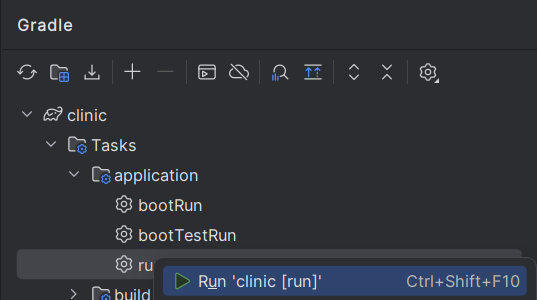

### 

After launching the application, the window should look like this:

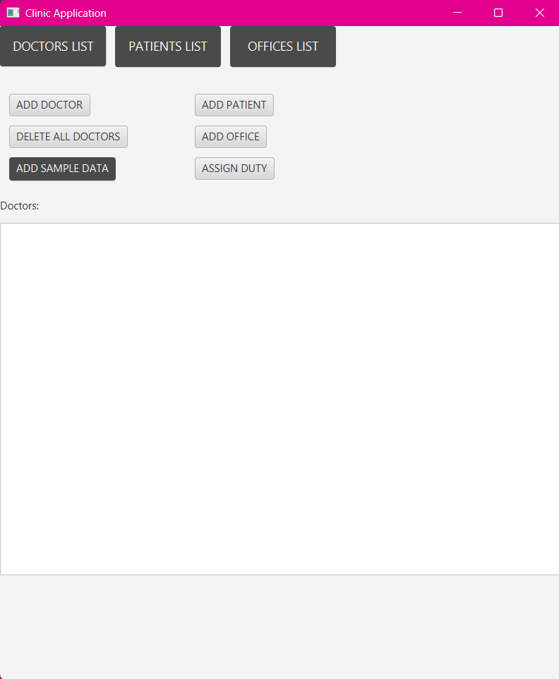

### Add sample data
After clicking button **ADD SAMPLE DATA**, the database is filled with sample data.

It adds:
- **7 doctors**: 3 with one specialization, 2 with another, 1 with a third, and 1 with a fourth.
- **3 offices**
- **5 patients**
- **15 duties**
- **9 appointments**

After adding the sample data, the application looks like this:

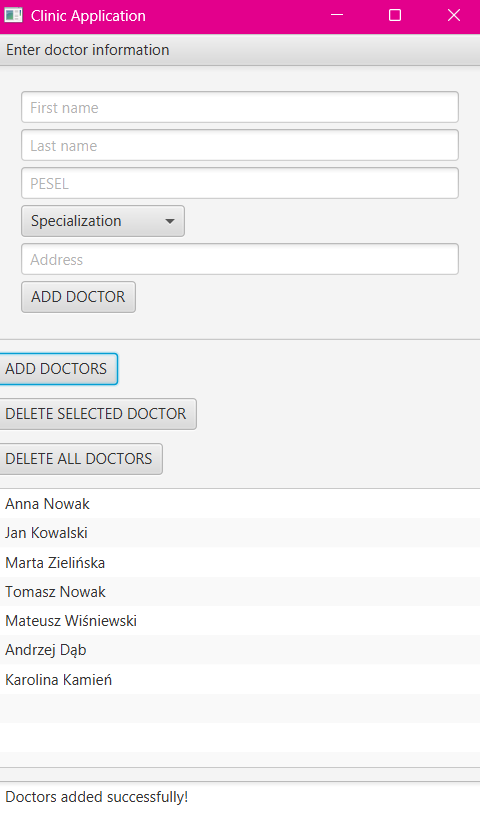

---

At the top of the application there are three navigation buttons:
- **DOCTORS LIST** – shows the list of all doctors
- **PATIENTS LIST** – shows the list of all patients
- **OFFICES LIST** – shows the list of all offices

---

## Doctors

### Viewing doctor details
When you click a doctor in the list, the application displays details:
- full name
- specialization
- address
- assigned duties (day of week + office + start/end time)

There is also a button **Delete doctor** to remove the selected doctor.

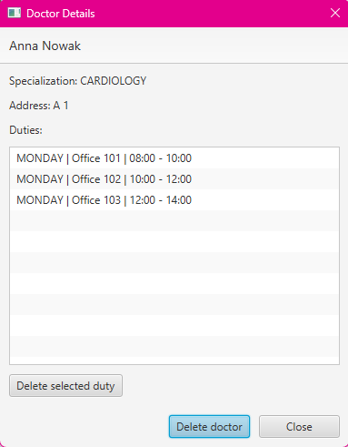

> Deleting a doctor is blocked if duties are assigned to them.

### Deleting duty
To delete duty:
- select it from the list in doctor details
- click **Delete duty** button.
> Deleting duty is blocked if appointments are assigned to it.

### Adding a doctor
Click **ADD DOCTOR** to open a modal window.  
Fill in all fields, choose specialization and then click **Add** to create the doctor.
You can also click **Cancel** to close the window without saving.

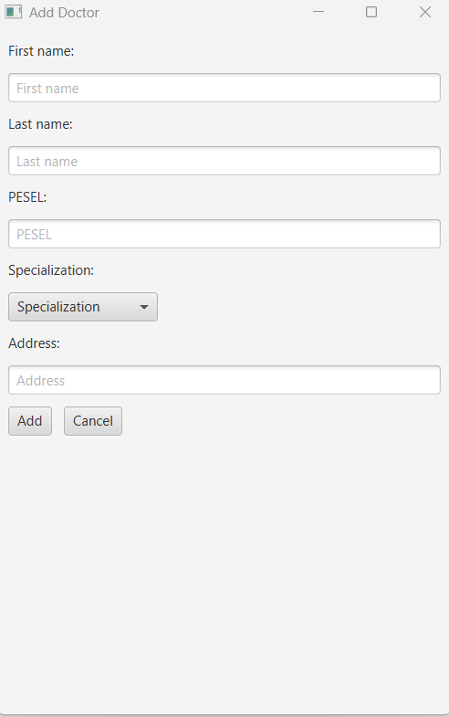

### Deleting all doctors
The button **DELETE ALL DOCTORS** removes all doctors from the database (and refreshes the list immediately).


---

## Patients

### Viewing patient details
When you click a patient in the list, the application displays:
- full name,
- address,
- list of appointments assigned to the patient

There is also a button **Delete patient** to remove the selected patient.

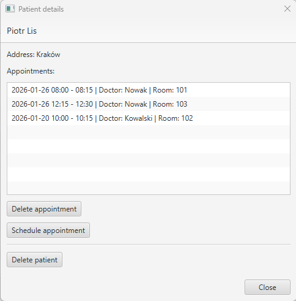
> Deleting patient is blocked if appointments are assigned to them.
> 
## Appointments
### Scheduling an appointment from patient details
In the patient details view there is a button **Schedule Appointment**, click it to open a scheduling window.
Select specialization, then doctor with the selected specialization. Select preferred date range, click **Show available slots**
Choose one available slot from the list. Click **Schedule Appointment** to confirm.


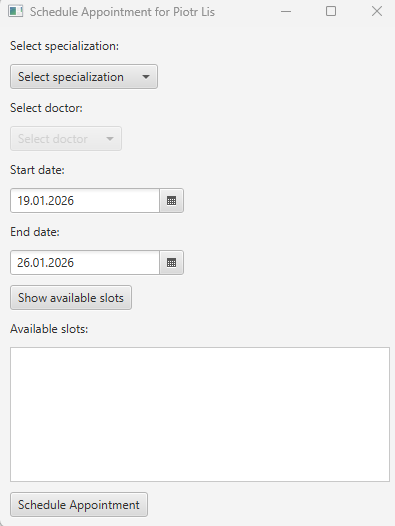
### Deleting an appointment from patient details
In the patient details view selecting an appointment from the appointments list and clicking the Delete appointment button,
**Delete appointment** removes the selected appointment. The list refreshes automatically after deletion.
### Adding a patient
Click **ADD PATIENT** to open a modal window.  
Fill in the data and click **Add** (or **Cancel** to close without saving).

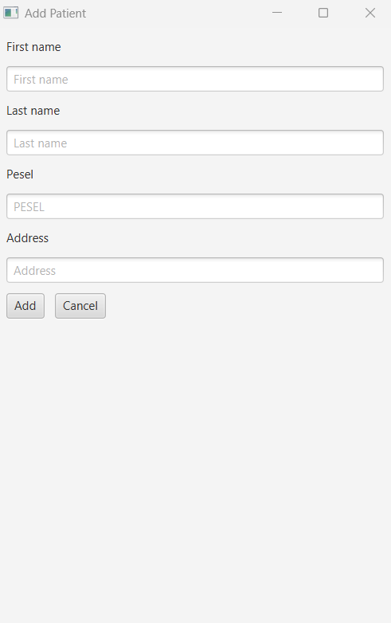

---

## Offices

### Viewing office details
When you click an office in the list, the application displays:
- room number
- assigned duties (doctor + day of week + start/end time)

- There is also a button **Delete office** to remove the selected office.

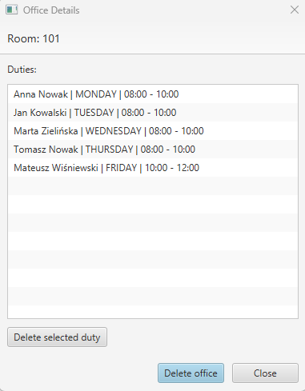
> Deleting an office is blocked if duties are assigned to it.

### Deleting duty
To delete duty:
- select it from the list in office details
- click **Delete duty** button.
> Deleting duty is blocked if appointments are assigned to it.

### Adding an office
Click **ADD OFFICE** to open a modal window.  
Provide the room number and click **Add** (or **Cancel**).


---

## Duties

### Assigning a duty
To assign a duty, click **ASSIGN DUTY** to open a window.
Select:
- day of week,
- start time / end time,
then click **Check availability** to reload lists of available doctors and offices in selected day of the week and time.
Choose a doctor and an office from the list, then click **Assign** to save the duty.

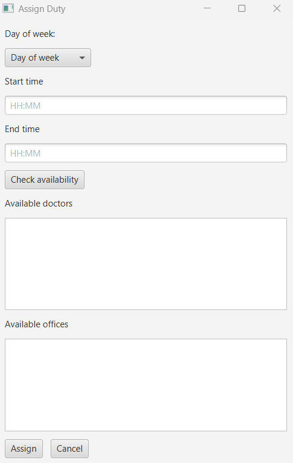

### Deleting duty
To delete duty:
- select it from the list in doctor or office details
- click **Delete duty** button.
> Deleting duty is blocked if appointments are assigned to it.

## API Documentation (Swagger)
The REST API is documented using **Swagger / OpenAPI**.

After starting the application, Swagger UI is available at:
http://localhost:8080/swagger-ui.html

The OpenAPI specification can be accessed at:
http://localhost:8080/v3/api-docs
